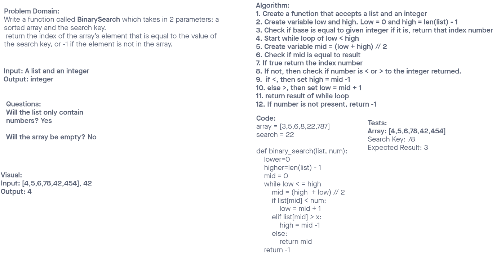

# Binary Search of Sorted Array
Write a function called BinarySearch which takes in 2 parameters: a sorted array and the search key.

Return the index of the array’s element that is equal to the value of the search key, or -1 if the element is not in the array.

## Whiteboard Process

## Approach & Efficiency
<!-- What approach did you take? Discuss Why. What is the Big O space/time for this approach? -->

My  approach was to take the high and low of the array and divide that by 2 tro get the middle number. If that wasnt equal to the given parameter, then the while loop will search in mid + 1 or mid -1 depending on if it was higher or lower. I could not figure out how to do it recursively without more than 2 parameters. 
