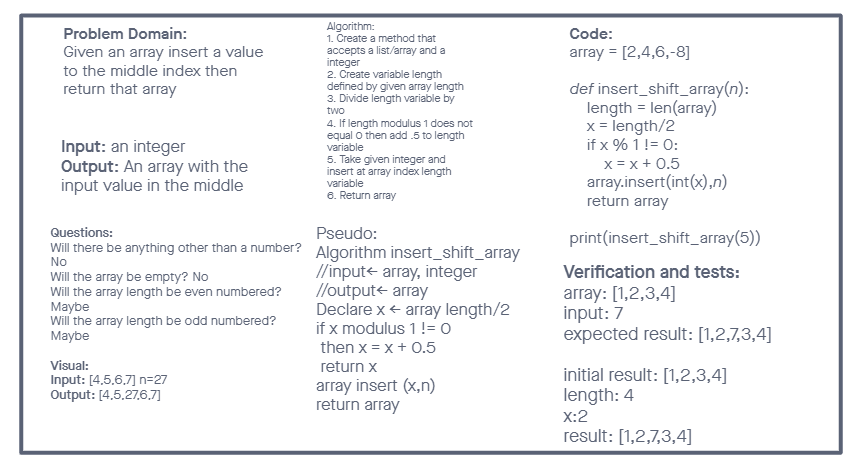

# Insert to Middle of an Array
Write a function called insertShiftArray which takes in an array and a value to be added. Without utilizing any of the built-in methods available to your language, return an array with the new value added at the middle index.

## Whiteboard Process

Worked on this challenge with Chris Rarig.

## Approach & Efficiency
<!-- What approach did you take? Discuss Why. What is the Big O space/time for this approach? -->

Our approach was to switch between driver and navigator every 2 sections. We talked about each piece before moving onto the next to make sure we both understood what was going on. 10/10 would recommend as partner
