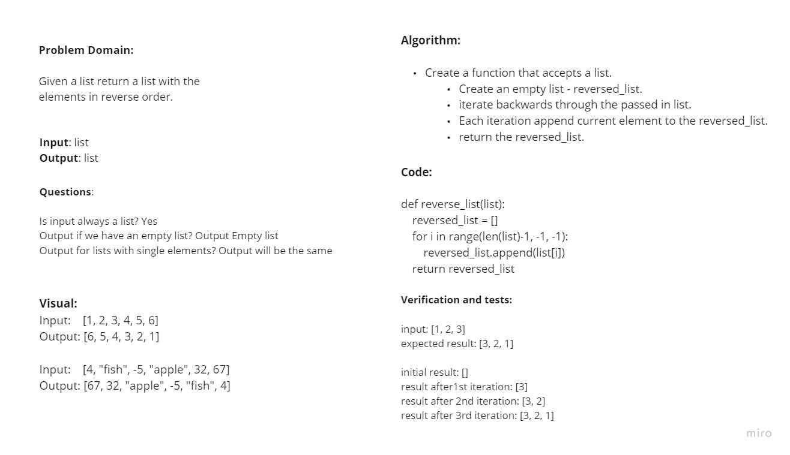

# Reverse an Array
Write a function called reverseArray which takes an array as an argument. Without utilizing any of the built-in methods available to your language, return an array with elements in reversed order.

## Whiteboard Process

Worked on this challenge with Wenhao.

## Approach & Efficiency
<!-- What approach did you take? Discuss Why. What is the Big O space/time for this approach? -->

This was my first whiteboard, so Wenhao drove a bit more than I did while I wrote down what he said. We both talked about what was going on and made sure we both understood what was going on before we moved on to the next piece. I don't know what the Big O for this was. Not too sure what that is yet.
