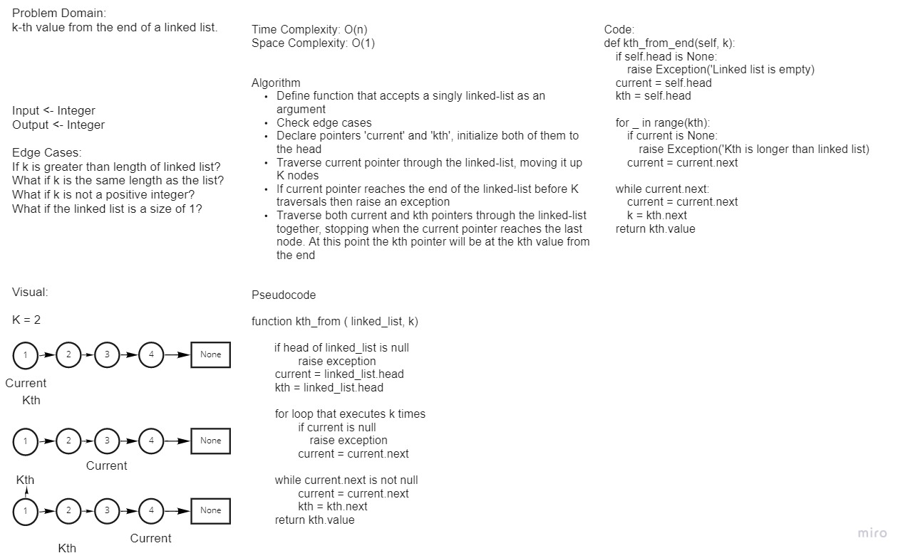

# Challenge Summary
Create a method that returns a nodes value that is k places from the tail of a linked list.

## Whiteboard Process


## Approach & Efficiency
Our approach was to traverse the current by K places and then traversing the k and current pointers through the linked list. When current reaches the end, we return the value of K.

## Solution
```
def test_kth_from_end():
    ll = LinkedList()
    node1 = Node('Master Chief')
    ll.head = node1
    node2 = Node('Cortana')
    node1.next = node2
    node3 = Node('Noble 6')
    node2.next = node3
    node4 = Node('Samuel-034')
    node3.next = node4
    assert ll.kth_from_end(3) == 'Master Chief'


Returned value will be 'Master Chief'
```
