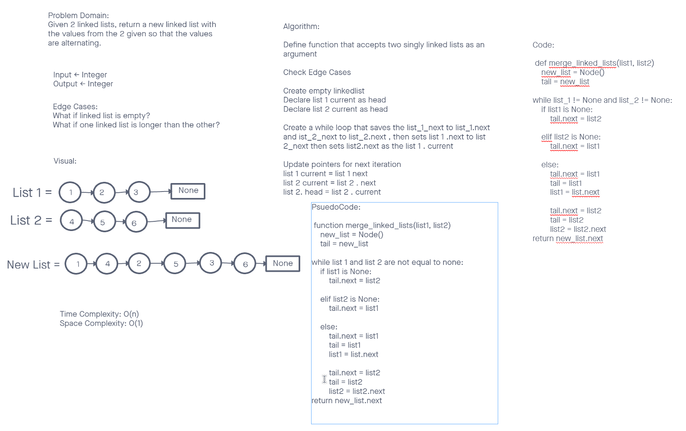

# Challenge Summary
Combine 2 linked lists and return the values of each in an alternating order into a third list

## Whiteboard Process


## Approach & Efficiency
The approach I took this time was to do tests first then write code.
I am not sure of what Big(O) for this is yet.

## Solution
```
  def merge_linked_lists(list_1, list_2):
    ll_3 = LinkedList()
    current1 = list_1.head
    current2 = list_2.head
    
    while current1 or current2:
      if current1:
        ll_3.append(current1)
        current1 = current1.next
        
      if current2:
        ll_3.append(current2.value)
        current2 = current2.next

    return ll_3
```
