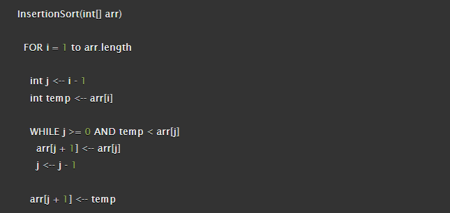

# Insertion Sort Blog

Insertion sort is a simple sorting algorithm that works similar to the way you sort playing cards in your hands. The list is virtually split into a sorted and an unsorted part. Values from the unsorted part are picked and placed at the correct position in the sorted part.

## Pseudocode


## Trace
Sample: ```[8,4,23,42,16,15]```

### Pass 1:  
In the first pass, assign variables j and temp.
```
i = 1
j = 0
temp = 8
```
We then check to see if they meet the conditions of the while loop. Because 0 is equal to J AND the temp variable ,***4***, is less than ```arr[j]```,***8***, we enter the loop and continue.
In the While loop, we assign the element at j, ***8***, which is at the 0th at the moment, and move it to the second element. We then subtract 1 from j and assign that integer to j. ```j=0```. We then go back to the start of the While loop and perform checks again. J is equal to 0 but temp is equal to 8, which is greater than ```arr[j]```, ***4***. The while loop is stopped and finally temp is assigned to ```arr[j+1]```, ***8***.


### Pass 2:
list at this time: ```[4,8,23,42,16,15]```  
For the 2nd pass we begin at the for loop. Again, we assign the variables.
```
i = 2
j = 1
temp = 23
```
We perform checks on the WHILE loop. j is greater than 0 but this time temp, ***23***, is not less than ```arr[j]```, ***8***. Therefore, the while loop is skipped as no changes need to be made.
Lastly, ```arr[j+1]``` is assigned temp.


### Pass 3:
list at this time: ```[4,8,23,42,16,15]```  
For the 3rd pass we begin at the for loop. Again, we assign the variables.
```
i = 3
j = 2
temp = 42
```
Next we check the WHILE loop again. J is greater than 0 but temp is not less than ```arr[j]```, **23**. The WHILE loop is skipped again as no changes need to be made.


### Pass 4:
list at this time: ```[4,8,23,42,16,15]```  
This is where things get interesting, so pay close attention. Just like before, we start at the for loop.
```
i = 4
j = 3
temp = 16
```
Next, we check the conditions for the WHILE loop. J is greater than 0 AND temp, **16**, is less than ```arr[j]```,**42**. The condtions are met and we enter the loop. We have evaluated that temp is less than ```arr[j]```, so now we assign ```arr[j]```, **42**, to the next position ```arr[j + 1]```. This places it after the 16. J is decremented by 1, so it now equals 2.   

list at this time: ```[4,8,23,16,42,15]```  

Now, we go back to the top of the while loop. J is still greater then 0 AND temp, **16**, is less than ```arr[j]```, **23**. So we must continue the WHILE loop. 
Now we move ```arr[j]```, **23**, to the next element using ```arr[j + 1]```. J is decremented again and now equals 1.
We head back to the start of the WHILE loop and perform another check. J is greater than 0 and temp, **16**, is not less than ```arr[j]```, **8**. So, the WHILE loop is broken and we assign temp to ```arr[j+1]```.  
list at this time: ```[4,8,16,23,42,15]```


### Pass 5:
This pass will be similar to pass 4.
We start at the FOR loop.
```
i = 5
j = 4
temp = 15
```
Now, we check the conditions for the WHILE loop. J is greater than 0 AND temp is less than ```arr[j]```, **42**. The conditions are met, so we enter the loop.

We move ```arr[j]```, **42**, to the 5th element by using ```arr[j+1]```. ```J``` is decremented by 1 and now equals 3.  
list at this time: ```[4,8,16,23,15,42]```

We go back to the start of the WHILE loop. ```J``` is greater then 0 AND temp, **15**, is less than ```arr[j]```, **23**. We enter the loop again and move ```arr[j]```, **23**, to the 4th element by using ```arr[j+1]```. ```J``` is decremented by 1 and now equals 2. 
list at this time: ```[4,8,16,15,23,42]```

Looks like were almost done. We go back to the start of the WHILE loop. ```J``` is greater then 0 AND temp, **15**, is less than ```arr[j]```, **16**. We enter the loop again and move ```arr[j]```, **16**, to the 3rd element by using ```arr[j+1]```. ```J``` is decremented by 1 and now equals 1.  

list at this time: ```[4,8,15,16,23,42]```

We perform another check on the WHILE loop. ```J``` is greater than 0 but now temp, **15**, is not less than ```arr[j]```, **16**. We break out of the WHILE loop and assign temp to ```arr[j+1]```.
After this iteration, ```i``` will increment to 6, forcing it to break out of the outer for loop and leaving our list now sorted.

## Working Code in Python
```
def insertion_sort(arr):
  for i in range(1, len(arr)):
    j = i - 1
    temp = arr[i]

    while j>=0 and temp < arr[j]:
      arr[j+1] = arr[j]
      j = j - 1

    arr[j+1] = temp
```

## Tests:
```
test_list = [8,4,23,42,16,15]
insertion_sort(test_list)
print(f'test_list: {test_list}')

test_list: [4, 8, 15, 16, 23, 42]

test_list2 = [20,18,12,8,5,-2]
insertion_sort(test_list2)
print(f'test_list2: {test_list2}')

test_list2: [-2, 5, 8, 12, 18, 20]
```
