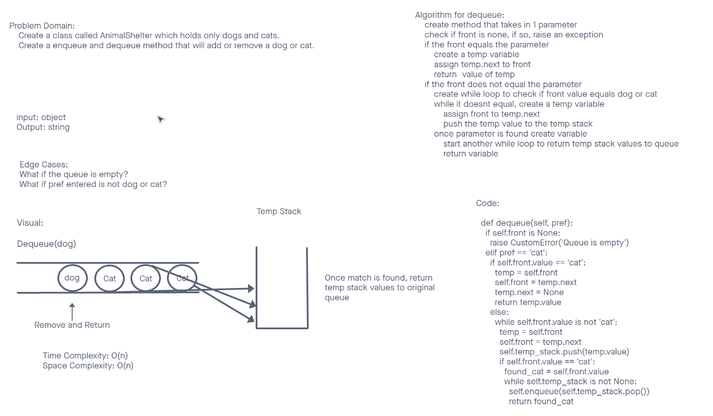

# Stacks and Queues
Using a Linked List as the underlying data storage mechanism, implement both a Stack and a Queue

## Challenge
Create a class called AnimalShelter which holds only dogs and cats.
The shelter operates using a first-in, first-out approach.
Implement the following methods:
  enqueue
    Arguments: animal
      animal can be either a dog or a cat object.
  dequeue
    Arguments: pref
      pref can be either "dog" or "cat"
    Return: either a dog or a cat, based on preference.
      If pref is not "dog" or "cat" then return null.

## Whiteboard


## Approach & Efficiency
I took a TDD approach and designed my tests before I wrote my code. It made it 1000% easier.

enqueue:
Big(O):
Space: O(n)
Time: O(1)

dequeue:
Big(o):
Space: O(n)
Time: O(n)

## API
Stack:
Pop
Push

Queue:
Enqueue
Dequeue

Solution:
```
  def enqueue(self, animal):
    node = Node(animal)
    if self.rear is None:
      self.front = node
      self.rear = node
    else:
      self.rear.next = node
      self.rear = self.rear.next

  def dequeue(self, pref):
    if self.front is None:
      raise CustomError('Queue is empty')
    elif pref == 'cat':
      if self.front.value == 'cat':
        temp = self.front
        self.front = temp.next
        temp.next = None
        return temp.value 
      else:
        while self.front.value is not 'cat':
          temp = self.front
          self.front = temp.next
          self.temp_stack.push(temp.value)
          if self.front.value == 'cat':
            found_cat = self.front.value
            while self.temp_stack is not None:
              self.enqueue(self.temp_stack.pop())
              return found_cat
    elif pref == 'dog':
      print(f'pref: {pref}')
      if self.front.value == 'dog':
        temp = self.front
        self.front = temp.next
        temp.next = None
        return temp.value 
      else:
        while self.front.value is not 'dog':
          temp = self.front
          self.front = temp.next
          self.temp_stack.push(temp.value)
          if self.front.value == 'dog':
            found_dog = self.front.value
            while self.temp_stack is not None:
              self.enqueue(self.temp_stack.pop())
              return found_dog
    else:
      return None
```
