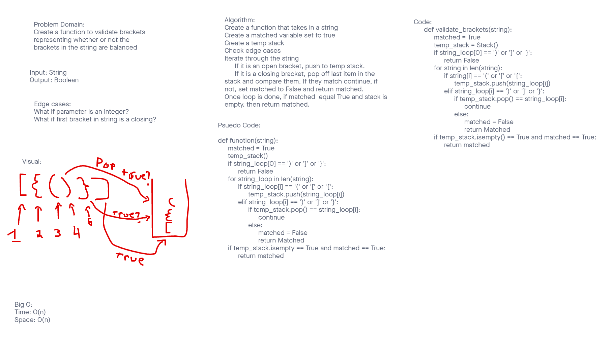

# Stacks and Queues
Create a function to validate brackets and return a boolean on whether or not the brackets in the string are balanced

## Challenge
Create a function to validate brackets and return a boolean on whether or not the brackets in the string are balanced

Write a function called validate brackets
Arguments: string
Return: boolean
  representing whether or not the brackets in the string are balanced

There are 3 types of brackets:

Round Brackets : ()
Square Brackets : []
Curly Brackets : {}

## Whiteboard


## Approach & Efficiency
I took a TDD approach and designed my tests before I wrote my code. I realized well into my original plan that I was not able to check if the input was a letter or bracket, So I had to research and change my approach to a list of pre-determined values to check for.

Big(O):
Space: O(n)
Time: O(n)

## API

Solution:
```
  def validate_brackets(string):
  open_brackets = ['(', '{', '[', '<']
  closed_brackets = [')', '}', ']', '>']
  validated = True
  temp_stack = Stack()
  if string[0] == ')' or string[0] == ']' or string[0] == '}' or string[0] == '>':
    validated = False
    return validated
  else:
    for i in string:
      if i in open_brackets:
        temp_stack.push(i)
      elif i in closed_brackets:
        closed = closed_brackets.index(i)
        if open_brackets[closed] == temp_stack.top.value:
          temp_stack.pop()
        else:
          validated = False
          return validated 
    if temp_stack.isEmpty() == True and validated == True:
      print('I should not do this yet')
      return validated
```
## References:
https://pythonexamples.org/python-if-or/
https://www.geeksforgeeks.org/check-for-balanced-parentheses-in-python/

