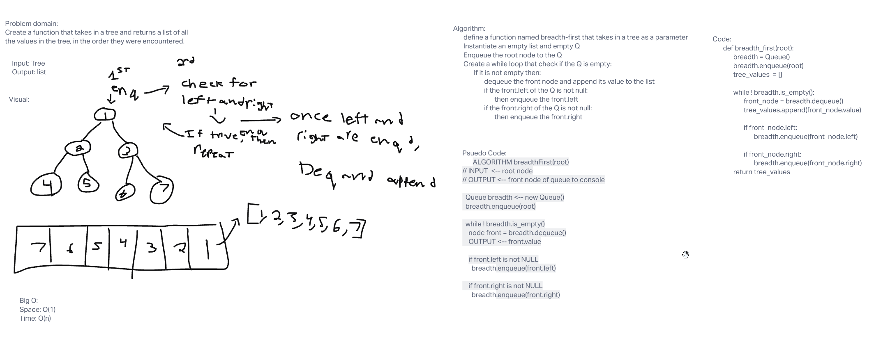

## Challenge
Create a function called breadth first that takes in a Tree and

## Approach & Efficiency
I took a TDD approach with this because that would be the optimal way when writing code.
Big O:
    Space:O(1)
    Time:O(n)

## API
breadth_first - Returns each value in a tree in the order it is encountered

## White Board

