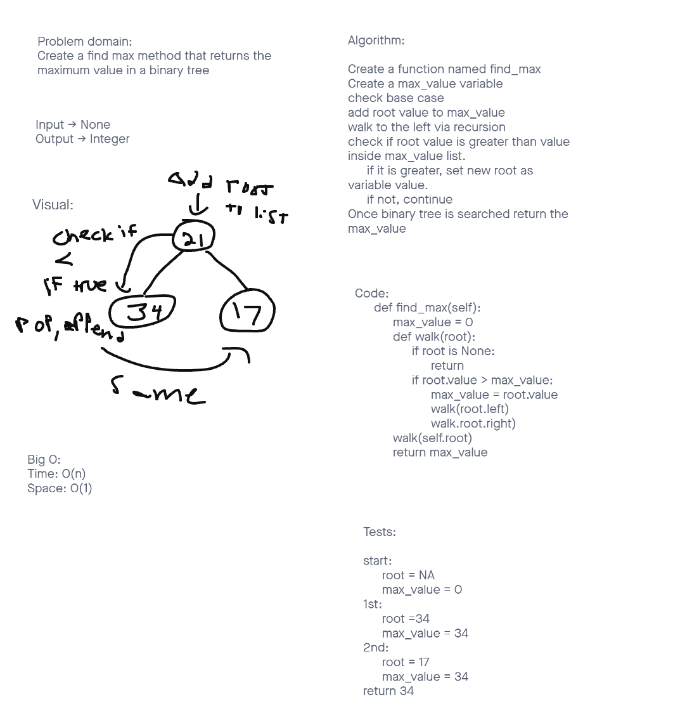

# Trees-max
Binary Tree
  Create a Binary Tree class
    Define a method that finds the max value in a Binary Tree

## Challenge
Create a method that finds the max value in a binary tree.

## Approach & Efficiency
I took a TDD approach with this because that would be the optimal way when writing code.
Big O:
  Binary Tree:
    Space:O(1)
    Time:O(n)

## API
find_max - Returns highest value in binary tree

## White Board

